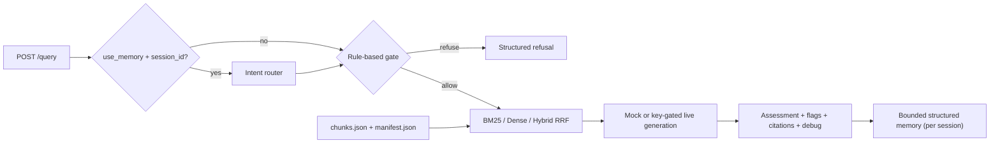

# AML Red Flag RAG

A runnable FastAPI demo for evidence-oriented anti-money-laundering red-flag
analysis. Demonstrates single-turn RAG, evidence-bound answers, citation
references, scope-based refusal, debug metadata, optional live and local
generation paths, and opt-in structured conversation memory with deterministic
intent routing.

本專案以洗錢防制（AML）紅旗辨識為應用場景，展示跨語言混合檢索、Pre-LLM Gate
拒答、具引用依據的結構化生成、可選擇性啟用的多輪結構化對話記憶與確定性 intent
routing，以及可選的本地 Ollama 生成路徑。這是一個以 AI 工程能力為核心的教學示
範專案，不是 production AML 合規系統。

This is an educational and evaluation-oriented AI engineering demo, not legal
advice, a transaction-monitoring system, or a substitute for an AML investigator.

## For Reviewers

| Reader | Start here |
|---|---|
| HR / Recruiter | [`docs/hr_project_brief.md`](docs/hr_project_brief.md) |
| Technical reviewer | [`docs/demo_evidence_pack.md`](docs/demo_evidence_pack.md) |
| Interview preparation | [`docs/project_map_for_interview.md`](docs/project_map_for_interview.md) |
| Structured memory design | [`docs/conversation_memory.md`](docs/conversation_memory.md) |

## Current Implementation Status

| Capability | Status | Notes |
|---|---|---|
| FastAPI `/health`, `/query`, `/sources` | Implemented | Contract-tested single-turn API |
| BM25 retrieval | Implemented | Rebuilt in memory from `chunks.json` |
| Dense FAISS retrieval + RRF hybrid | Implemented | Requires full profile and an available embedding model |
| Honest dense-to-BM25 degradation | Implemented | Exposed through `debug.fallback_used` and `fallback_reason` |
| Rule-based Pre-LLM Gate | Implemented | TBML, sanctions, and tax-evasion scope refusals |
| Deterministic mock generation | Implemented | Default; no keys or network calls |
| Groq / Gemini / Gemma REST generation | Experimental | Key-gated; failures fall back to mock |
| Ollama local generation mode | Optional | Local HTTP path; failures fall back to mock |
| Semantic scope classifier | Experimental | Off by default; enable with `ENABLE_SEMANTIC_GATE=true` |
| Included knowledge corpus | Implemented | Default 12-chunk demo sample plus optional public 226-chunk profile |
| Offline private-PDF indexing | Implemented, operator-run | Requires full profile and private PDFs |
| Intent routing + structured conversation memory | Implemented | Opt-in, local in-process, bounded; see `docs/conversation_memory.md` |
| Evaluation automation | Partial | API smoke, CQC-RAG Lite, failure diagnostics, and multi-turn eval scripts |

## Architecture



Single-turn requests skip the router and memory entirely. When memory is
enabled, the router selects a route and the pipeline reads/updates a bounded
per-session memory object; see
[`docs/conversation_memory.md`](docs/conversation_memory.md).

Retrieval uses the notebook's RRF formula, `1 / (60 + rank)`, followed by
`retrieval_priority` weighting. The full profile builds an in-memory normalized
FAISS `IndexFlatIP`; the lite profile runs BM25 and labels dense/hybrid requests
as fallbacks.

## Quick Start: Native Python

Python 3.11 is the container target. Python 3.12 was used for the native
verification recorded in this repository.

Full profile, including dense retrieval:

```powershell
python -m venv .venv
.venv\Scripts\python.exe -m pip install -r requirements.txt
Copy-Item .env.example .env
.venv\Scripts\python.exe -m uvicorn api.main:app --reload
```

Lightweight profile, with honest BM25 fallback:

```powershell
python -m venv .venv
.venv\Scripts\python.exe -m pip install -r requirements-lite.txt
Copy-Item .env.example .env
.venv\Scripts\python.exe -m uvicorn api.main:app --reload
```

Bash equivalents:

```bash
python -m venv .venv
.venv/bin/python -m pip install -r requirements.txt
cp .env.example .env
.venv/bin/python -m uvicorn api.main:app --reload
```

Open `http://localhost:8000/health`. Mock mode is the default and requires no
API keys.

## Corpus Profiles

The service supports two committed corpus profiles:

- `sample` (default): 12 small, hand-written bilingual demo chunks in
  `artifacts/index`. This profile keeps startup fast and preserves the original
  smoke-test behavior.
- `public_226`: 226 chunks imported from public AML materials in
  `data/public_corpus_226`, with the source PDFs committed under
  `data/public_corpus_226/sources`.

To run the API with the public profile:

```powershell
$env:CORPUS_PROFILE = "public_226"
.venv\Scripts\python.exe -m uvicorn api.main:app --reload
```

The public profile uses `data/public_corpus_226/chunks.json` as canonical
corpus content and `data/public_corpus_226/source_manifest.json` for source
summaries. BM25 and optional dense FAISS indexes are rebuilt from `chunks.json`
at startup; legacy notebook pickle/binary indexes are not required.

## Optional Live Gemma Mode Via Google AI Studio

Mock mode remains the default and requires no API key. To use the optional
Gemma live path, provide a Google AI Studio API key through `GEMINI_API_KEY`
and explicitly select a Gemma model available to that key. Model availability
can vary, so this repository does not hardcode a universal Gemma model ID.

```powershell
Copy-Item .env.example .env
# Edit .env:
# LLM_MODE=gemma
# MODEL_NAME=<your-available-gemma-model-id>
# GEMINI_API_KEY=<your-google-ai-studio-key>

.venv\Scripts\python.exe -m uvicorn api.main:app --reload
```

Optional manual live smoke request:

```powershell
$body = @{
  query = "Funds show rapid movement through a virtual asset exchange."
  retrieval_mode = "hybrid"
  llm_mode = "gemma"
  include_debug = $true
} | ConvertTo-Json

Invoke-RestMethod -Uri http://localhost:8000/query `
  -Method Post -ContentType "application/json" -Body $body
```

Gemma uses the existing Google Generative Language API `generateContent` path.
Its live responses are still normalized against retrieved evidence, and
provider errors or malformed responses fall back to mock with debug details.
Automated tests use mocked provider responses and do not require a real key.

## Optional Ollama Local Mode

Mock mode remains the default and the Ollama path is for local verification
only. It is not a model-quality benchmark, and it still normalizes the output
against retrieved evidence before returning a response.

This path uses the local Ollama HTTP server directly. Run Ollama outside this
repository, pull the model you want to test, and point the service at it with
`OLLAMA_BASE_URL` and `OLLAMA_MODEL`.

```powershell
# Install and start Ollama outside this repo.
# Download the Ollama installer from https://ollama.com/download and launch it.

ollama pull llama3.1:8b

Copy-Item .env.example .env
# Edit .env:
# LLM_MODE=ollama
# OLLAMA_BASE_URL=http://localhost:11434
# OLLAMA_MODEL=llama3.1:8b

.venv\Scripts\python.exe -m uvicorn api.main:app --reload
```

Optional manual local smoke request:

```powershell
$body = @{
  query = "Funds show rapid movement through a virtual asset exchange."
  retrieval_mode = "hybrid"
  llm_mode = "ollama"
  include_debug = $true
} | ConvertTo-Json

Invoke-RestMethod -Uri http://localhost:8000/query `
  -Method Post -ContentType "application/json" -Body $body
```

If Ollama is unavailable, times out, or returns malformed JSON, the service
falls back to mock and records the reason in `debug`.

## Quick Start: Docker Compose

The Dockerfile and `docker-compose.yml` are provided and were reviewed for
correctness, but a Docker build and container health check were not run on the
development machine (Docker was unavailable on the Windows host used for this
implementation).

The default image installs the full ML profile and is large. Its build
downloads the multilingual embedding model so normal startup can be offline.

```powershell
Copy-Item .env.example .env
docker compose up --build -d
Invoke-RestMethod http://localhost:8000/health
docker compose down
```

```bash
cp .env.example .env
docker compose up --build -d
curl http://localhost:8000/health
docker compose down
```

## API Examples

PowerShell:

```powershell
$body = @{
  query = "Funds show rapid movement through a virtual asset exchange."
  top_k = 5
  retrieval_mode = "hybrid"
  llm_mode = "mock"
  include_debug = $true
} | ConvertTo-Json

Invoke-RestMethod -Uri http://localhost:8000/query `
  -Method Post -ContentType "application/json" -Body $body

Invoke-RestMethod http://localhost:8000/sources
```

Bash:

```bash
curl -X POST http://localhost:8000/query \
  -H 'Content-Type: application/json' \
  -d '{"query":"Funds show rapid movement through a virtual asset exchange.","top_k":5,"retrieval_mode":"hybrid","llm_mode":"mock","include_debug":true}'

curl http://localhost:8000/sources
```

`POST /query` returns `answer`, `assessment`, `identified_flags`, `citations`,
`refusal`, and optional `debug`. Gate refusals short-circuit retrieval. Missing
artifacts leave the service running in degraded mode and make `/query` return a
clear `503 ARTIFACTS_NOT_FOUND` response.

## Structured Conversation Memory (Multi-Turn)

The service now supports opt-in multi-turn AML analysis through **structured
conversation memory** and a deterministic **intent router**. This is local,
in-process, bounded demo memory — *not* an unlimited transcript and *not* a
production memory store. Single-turn clients are unaffected: omit the new
fields and behavior is exactly as before.

Memory activates only when `use_memory` is true, a `session_id` is supplied,
and `memory_mode` is not `"off"`. Routing uses rules only and never depends on a
live LLM. Every turn resolves to one of **three high-level outcomes**
(`debug.route_family`):

1. **`retrieve`** — evidence retrieval happened (`retrieve` or
   `retrieve_with_memory`).
2. **`refuse`** — out of scope; memory is left untouched.
3. **`no_retrieval_response`** — answered deterministically from conversation
   state: `answer_from_history` (recall/explain a prior answer) or
   `ask_clarifying_question` (vague input → ask the user for detail).

The finer `debug.intent_route` keeps all five labels for debugging and tests.
Memory keeps the active scenario, deduplicated red flags, previous citations,
retrieved chunk IDs, prior assessment, a referenceable prior-answer summary,
unresolved clarification needs, and a bounded list of recent turn summaries.
Out-of-scope ("refuse") turns never pollute the active AML scenario. See
[`docs/conversation_memory.md`](docs/conversation_memory.md) for the full
schema, bounds, and routing policy.

Two-turn demo session (PowerShell):

```powershell
# Turn 1 — establish an AML scenario
$t1 = @{
  query = "Funds show rapid movement through a virtual asset exchange."
  retrieval_mode = "bm25"
  llm_mode = "mock"
  include_debug = $true
  session_id = "demo-1"
  use_memory = $true
} | ConvertTo-Json
Invoke-RestMethod -Uri http://localhost:8000/query `
  -Method Post -ContentType "application/json" -Body $t1

# Turn 2 — recall the prior flags from structured memory
$t2 = @{
  query = "剛剛那個風險可以再說明嗎？"
  include_debug = $true
  session_id = "demo-1"
  use_memory = $true
} | ConvertTo-Json
Invoke-RestMethod -Uri http://localhost:8000/query `
  -Method Post -ContentType "application/json" -Body $t2

# Inspect the bounded structured memory for this session
Invoke-RestMethod http://localhost:8000/sessions/demo-1/memory

# Clear the session memory
Invoke-RestMethod -Uri http://localhost:8000/sessions/demo-1/memory -Method Delete
```

In the turn-2 response, `debug.intent_route` is `answer_from_history`,
`debug.referenced_previous_answer` is `true`, and `debug.active_flags` lists the
red flags carried over from turn 1. Asking `剛剛引用的是哪些來源？` instead
recalls the previous citations; a follow-up such as `那跟客戶職業不符有關嗎？`
routes to `retrieve_with_memory` (prior scenario context plus fresh retrieval).

### Multi-Turn Eval

With the service running, the multi-turn evaluator drives four fixed sessions
(scenario→recall, vague→ask-clarifying-question, out-of-scope→refuse,
scenario→citations) and checks routing (both `intent_route` and the
three-outcome `route_family`) and memory behavior:

```powershell
.venv\Scripts\python.exe scripts\run_multiturn_eval.py
```

Results are written to `eval/results/multiturn_latest.jsonl` and
`eval/reports/multiturn_latest.md` (both gitignored).

## API Smoke Eval

The API smoke eval is a contract smoke test for a running FastAPI service. It
does not calculate P@K or MRR, and it does not claim to reproduce the historical
retrieval benchmark.

```powershell
.venv\Scripts\python.exe scripts\run_api_smoke_eval.py
```

Per-case results are written to `eval/results/api_smoke_latest.jsonl`.

## Model Matrix Runner

The model matrix runner is a provider/mode behavior smoke matrix for the
running FastAPI service. It calls only the service API, defaults to `mock`,
and runs live modes only when they are explicitly requested.

```powershell
.venv\Scripts\python.exe scripts\run_model_matrix.py
```

Results are written to `eval/results/model_matrix_latest.jsonl` and
`eval/reports/model_matrix_latest.md`.

- Unsupported modes are recorded as `unsupported`; they do not fail the whole run by themselves.
- Different `MODEL_NAME` comparisons still require restarting or reconfiguring the service.
- This does not replace CQC-RAG Lite or Failure Diagnostics Lite.

## CQC-RAG Lite

CQC-RAG lite is a cross-query consistency evaluation, not a model quality
benchmark. It checks whether semantically similar query variants produce
stable assessments, identified flags, citations, and retrieved chunks.
It does not reproduce the historical retrieval benchmark or implement query
rewriting, reranking, logits-based scoring, or answer selection.

The evaluator uses mock mode by default and requires a running FastAPI service.

```powershell
.venv\Scripts\python.exe scripts\run_cqc_eval.py
```

Output is written to `eval/results/cqc_latest.jsonl`.
The evaluator also writes a human-readable runtime report to
`eval/reports/cqc_latest.md`.

See [`docs/cqc_rag_lite_notes.md`](docs/cqc_rag_lite_notes.md) for the
engineering scope, interpretation guidance, and explicit non-goals.

## Failure Diagnostics Lite

Failure Diagnostics Lite reads generated API smoke and CQC-RAG Lite JSONL
outputs and turns observable issues into reviewer-facing categories such as
retrieval fallback, citation instability, retrieved-chunk instability,
identified-flag instability, refusal instability, and API smoke failures.

```powershell
.venv\Scripts\python.exe scripts\run_failure_diagnostics.py
```

The local report is written to
`eval/reports/failure_diagnostics_latest.md`. This is diagnostic and
observability tooling: it does not change the RAG pipeline and does not claim
AML correctness or model quality. See
[`docs/failure_diagnostics_lite.md`](docs/failure_diagnostics_lite.md).

## Reviewer Demo Pack

The reviewer pack runs the repository's static checks and, when the FastAPI
service is already running, the live API smoke and CQC-RAG Lite evaluations.

```powershell
.venv\Scripts\python.exe scripts\run_reviewer_pack.py
```

Live API checks require the service to already be running. See the
[`reviewer guide`](docs/reviewer_guide.md) and
[`demo scope ADR`](docs/adr/0001-demo-scope-and-honesty.md).

## Demo Walkthrough

For a human-readable interview/demo narrative, see
[`docs/demo_walkthrough.md`](docs/demo_walkthrough.md).

## Verification

```powershell
.venv\Scripts\python.exe -m compileall api rag_core indexing tests scripts
.venv\Scripts\python.exe -m pytest tests -q
```

For a running native or container service:

```powershell
.venv\Scripts\python.exe tests\smoke_test.py
```

Set `SMOKE_BASE_URL` to test a non-default address.

## Artifact Policy and Offline Indexing

The repository commits only:

- `artifacts/index/chunks.json`: 12 small, hand-written demo chunks.
- `artifacts/index/manifest.json`: demo provenance and source summaries.
- `data/public_corpus_226/chunks.json`: 226 public AML chunks imported from the
  legacy notebook handoff.
- `data/public_corpus_226/source_manifest.json`: public corpus manifest derived
  from the handoff metadata and chunk/source summaries.
- `data/public_corpus_226/sources/*.pdf`: small public source PDFs for the
  `public_226` profile.

It does not include private raw PDFs, API keys, `.env`, pickle indexes, or
large FAISS files. At service startup, BM25 and optional FAISS indexes are
rebuilt in memory from the committed chunk text.

See [`docs/legacy_notebook_artifacts.md`](docs/legacy_notebook_artifacts.md)
for why the legacy FAISS/BM25/tokenized pickle artifacts are not runtime
dependencies.

To build artifacts from operator-supplied private PDFs:

```powershell
.venv\Scripts\python.exe indexing\build_data_v2.py `
  --pdf-dir data\private `
  --out-dir artifacts\index `
  --version private-build-v1
```

The script writes service-compatible JSON plus local-only FAISS/BM25 artifacts.
These generated binary and pickle files are gitignored.

## Notebook Experiment Results

The following are historical **v4 notebook experiment results on a 226-chunk
corpus**. They are not benchmark claims for either service profile and are not
re-run by the current test suite.

| Retrieval strategy | P@3 | P@5 | Recall@5 | MRR |
|---|---:|---:|---:|---:|
| Dense (FAISS) | 0.267 | 0.180 | 0.825 | 0.670 |
| BM25 | 0.083 | 0.050 | 0.250 | 0.250 |
| Hybrid (RRF) | 0.250 | 0.180 | 0.825 | 0.649 |

The notebook research found that multilingual dense retrieval dominated BM25
for cross-language queries, while RRF could inherit systematic BM25 noise.
Later notebook versions explored query rewriting, state decoupling, and intent
routing to reduce multi-turn false positives. Those experiments remain
available in the display notebooks but are not part of the service API.

## Evaluation Evidence Chain

The following artifacts make the historical benchmark traceable. They record
notebook-era results and are **not** automatically reproduced by the current
service tests. Legacy binary FAISS indexes and BM25/tokenized pickles are
intentionally not committed.

| Artifact | Path | Contents |
|---|---|---|
| Annotated test set | `eval/queries/scenario_20_annotated.json` | 20 bilingual AML queries with chunk-level ground-truth relevance annotations |
| Benchmark results | `eval/results/retrieval_scenario20_results.json` | Per-query P@3 / P@5 / Recall@5 / MRR for dense, BM25, and hybrid; source of the table above |
| Cross-language baseline | `eval/results/retrieval_basic2_v1.json` | 2-query sanity check; shows BM25 Recall@5 = 0.000 on Chinese queries against English corpus |
| Corpus provenance | `eval/provenance/corpus_index_v2_metadata.json` | Embedding model, chunk size, vector dimension, and total chunk count for the private corpus |

Narrative explanation of the benchmark design, query categories, and
retrieval failure modes is in [`docs/evaluation_notes.md`](docs/evaluation_notes.md).

## Repository Guide

```text
api/                    FastAPI application
rag_core/               config, schemas, loader, retrieval, gate, generation, pipeline
rag_core/intent_router.py  deterministic multi-turn intent routing
rag_core/memory/         bounded structured conversation memory + in-process store
indexing/               offline private-PDF artifact builder
artifacts/index/         committed sample chunks and manifest
data/public_corpus_226/  committed public 226-chunk corpus profile and PDFs
tests/                  API contract tests and HTTP smoke test
docs/                   demo contract, migration notes, implementation plan
notebooks_archive/       committed notebook migration sources
*_display.ipynb          curated research notebooks; intentionally preserved
```

## Known Limitations

- The default sample corpus is intentionally tiny, and the public 226-chunk
  profile is still not production AML coverage.
- Mock generation never emits `confirmed`; it returns `possible`, `unlikely`,
  or `refuse`.
- Dense startup needs the model in cache or network access. If unavailable,
  the service degrades to BM25 and reports why.
- Live Groq/Gemini/Gemma paths are not verified without operator-provided keys.
- The semantic gate threshold is experimental and disabled by default.
- Conversation memory is local, in-process, and bounded: it is not persisted,
  not shared across workers, and is lost on restart. It is a demo memory store,
  not a production one.
- Intent routing is rule-based and will not capture every phrasing of a
  follow-up. Ingestion APIs and databases remain out of scope.

## Roadmap

- Add a public, licensed evaluation corpus and repeatable retrieval benchmark.
- Add regression tests for dense and live-provider paths.
- Expose operator-controlled ingestion and index versioning.
- Harden conversation memory (persistence, summarization) only after defining a
  stable cross-process contract.
