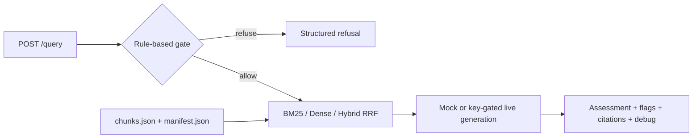

# AML Red Flag RAG

A runnable FastAPI demo and a notebook research archive for evidence-oriented
anti-money-laundering red-flag analysis.

本專案以洗錢防制（AML）紅旗辨識為應用場景，探索中英文文件的跨語言檢索、
文件層級加權、Pre-LLM Gate，以及具引用依據的結構化判斷。現在的
`repo-consolidation` 版本將 notebook 中的單輪核心流程整理成可執行的 FastAPI
與 Docker Compose demo；多輪對話與 intent routing 仍保留在研究 notebook。

This is an educational demo, not legal advice, a transaction-monitoring
system, or a substitute for an AML investigator.

## Current Implementation Status

| Capability | Status | Notes |
|---|---|---|
| FastAPI `/health`, `/query`, `/sources` | Implemented | Contract-tested single-turn API |
| BM25 retrieval | Implemented | Rebuilt in memory from `chunks.json` |
| Dense FAISS retrieval + RRF hybrid | Implemented | Requires full profile and an available embedding model |
| Honest dense-to-BM25 degradation | Implemented | Exposed through `debug.fallback_used` and `fallback_reason` |
| Rule-based Pre-LLM Gate | Implemented | TBML, sanctions, and tax-evasion scope refusals |
| Deterministic mock generation | Implemented | Default; no keys or network calls |
| Groq / Gemini REST generation | Experimental | Key-gated; failures fall back to mock |
| Semantic scope classifier | Experimental | Off by default; enable with `ENABLE_SEMANTIC_GATE=true` |
| Included knowledge corpus | Demo sample only | 12 hand-written bilingual chunks, not FATF source text |
| Offline private-PDF indexing | Implemented, operator-run | Requires full profile and private PDFs |
| Multi-turn conversation / intent routing | Planned for service | Notebook-only; see `experiment_rag_v4_display.ipynb` |
| Evaluation automation | Planned | Historical notebook results are documented below |

## Architecture



Retrieval uses the notebook's RRF formula, `1 / (60 + rank)`, followed by
`retrieval_priority` weighting. The full profile builds an in-memory normalized
FAISS `IndexFlatIP`; the lite profile runs BM25 and labels dense/hybrid requests
as fallbacks.

## Quick Start: Native Python

Python 3.11 is the container target. Python 3.12 was used for the native
verification recorded in this repository.

Full profile, including dense retrieval:

```powershell
python -m venv .venv
.venv\Scripts\python.exe -m pip install -r requirements.txt
Copy-Item .env.example .env
.venv\Scripts\python.exe -m uvicorn api.main:app --reload
```

Lightweight profile, with honest BM25 fallback:

```powershell
python -m venv .venv
.venv\Scripts\python.exe -m pip install -r requirements-lite.txt
Copy-Item .env.example .env
.venv\Scripts\python.exe -m uvicorn api.main:app --reload
```

Bash equivalents:

```bash
python -m venv .venv
.venv/bin/python -m pip install -r requirements.txt
cp .env.example .env
.venv/bin/python -m uvicorn api.main:app --reload
```

Open `http://localhost:8000/health`. Mock mode is the default and requires no
API keys.

## Quick Start: Docker Compose

The Dockerfile and `docker-compose.yml` are provided and were reviewed for
correctness, but a Docker build and container health check were not run on the
development machine (Docker was unavailable on the Windows host used for this
implementation).

The default image installs the full ML profile and is large. Its build
downloads the multilingual embedding model so normal startup can be offline.

```powershell
Copy-Item .env.example .env
docker compose up --build -d
Invoke-RestMethod http://localhost:8000/health
docker compose down
```

```bash
cp .env.example .env
docker compose up --build -d
curl http://localhost:8000/health
docker compose down
```

## API Examples

PowerShell:

```powershell
$body = @{
  query = "Funds show rapid movement through a virtual asset exchange."
  top_k = 5
  retrieval_mode = "hybrid"
  llm_mode = "mock"
  include_debug = $true
} | ConvertTo-Json

Invoke-RestMethod -Uri http://localhost:8000/query `
  -Method Post -ContentType "application/json" -Body $body

Invoke-RestMethod http://localhost:8000/sources
```

Bash:

```bash
curl -X POST http://localhost:8000/query \
  -H 'Content-Type: application/json' \
  -d '{"query":"Funds show rapid movement through a virtual asset exchange.","top_k":5,"retrieval_mode":"hybrid","llm_mode":"mock","include_debug":true}'

curl http://localhost:8000/sources
```

`POST /query` returns `answer`, `assessment`, `identified_flags`, `citations`,
`refusal`, and optional `debug`. Gate refusals short-circuit retrieval. Missing
artifacts leave the service running in degraded mode and make `/query` return a
clear `503 ARTIFACTS_NOT_FOUND` response.

## Verification

```powershell
.venv\Scripts\python.exe -m compileall api rag_core indexing tests
.venv\Scripts\python.exe -m pytest tests -q
```

For a running native or container service:

```powershell
.venv\Scripts\python.exe tests\smoke_test.py
```

Set `SMOKE_BASE_URL` to test a non-default address.

## Artifact Policy and Offline Indexing

The repository commits only:

- `artifacts/index/chunks.json`: 12 small, hand-written demo chunks.
- `artifacts/index/manifest.json`: demo provenance and source summaries.

It does not include raw PDFs, private data, API keys, `.env`, pickle indexes,
or large FAISS files. At service startup, BM25 and optional FAISS indexes are
rebuilt in memory from the committed chunk text.

To build artifacts from operator-supplied private PDFs:

```powershell
.venv\Scripts\python.exe indexing\build_data_v2.py `
  --pdf-dir data\private `
  --out-dir artifacts\index `
  --version private-build-v1
```

The script writes service-compatible JSON plus local-only FAISS/BM25 artifacts.
These generated binary and pickle files are gitignored.

## Notebook Experiment Results

The following are historical **v4 notebook experiment results on a private
226-chunk corpus**. They are not benchmark claims for the 12-chunk API demo and
are not re-run by the current test suite.

| Retrieval strategy | P@3 | P@5 | Recall@5 | MRR |
|---|---:|---:|---:|---:|
| Dense (FAISS) | 0.267 | 0.180 | 0.825 | 0.670 |
| BM25 | 0.083 | 0.050 | 0.250 | 0.250 |
| Hybrid (RRF) | 0.250 | 0.180 | 0.825 | 0.649 |

The notebook research found that multilingual dense retrieval dominated BM25
for cross-language queries, while RRF could inherit systematic BM25 noise.
Later notebook versions explored query rewriting, state decoupling, and intent
routing to reduce multi-turn false positives. Those experiments remain
available in the display notebooks but are not part of the service API.

## Evaluation Evidence Chain

The following artifacts make the historical benchmark traceable. They record
results from the private 226-chunk corpus and are **not** reproducible against
the 12-chunk demo corpus committed to this repository. Raw PDFs, binary FAISS
indexes, BM25 pickles, and the full private corpus text are intentionally not
committed.

| Artifact | Path | Contents |
|---|---|---|
| Annotated test set | `eval/queries/scenario_20_annotated.json` | 20 bilingual AML queries with chunk-level ground-truth relevance annotations |
| Benchmark results | `eval/results/retrieval_scenario20_results.json` | Per-query P@3 / P@5 / Recall@5 / MRR for dense, BM25, and hybrid; source of the table above |
| Cross-language baseline | `eval/results/retrieval_basic2_v1.json` | 2-query sanity check; shows BM25 Recall@5 = 0.000 on Chinese queries against English corpus |
| Corpus provenance | `eval/provenance/corpus_index_v2_metadata.json` | Embedding model, chunk size, vector dimension, and total chunk count for the private corpus |

Narrative explanation of the benchmark design, query categories, and
retrieval failure modes is in [`docs/evaluation_notes.md`](docs/evaluation_notes.md).

## Repository Guide

```text
api/                    FastAPI application
rag_core/               config, schemas, loader, retrieval, gate, generation, pipeline
indexing/               offline private-PDF artifact builder
artifacts/index/         committed sample chunks and manifest
tests/                  API contract tests and HTTP smoke test
docs/                   demo contract, migration notes, implementation plan
notebooks_archive/       committed notebook migration sources
*_display.ipynb          curated research notebooks; intentionally preserved
```

## Known Limitations

- The committed corpus is intentionally tiny and cannot represent production
  AML coverage.
- Mock generation never emits `confirmed`; it returns `possible`, `unlikely`,
  or `refuse`.
- Dense startup needs the model in cache or network access. If unavailable,
  the service degrades to BM25 and reports why.
- Live Groq/Gemini paths are not verified without operator-provided keys.
- The semantic gate threshold is experimental and disabled by default.
- Multi-turn state, intent routing, ingestion APIs, databases, and evaluation
  endpoints are not implemented in the service.

## Roadmap

- Add a public, licensed evaluation corpus and repeatable retrieval benchmark.
- Add regression tests for dense and live-provider paths.
- Expose operator-controlled ingestion and index versioning.
- Port multi-turn intent routing only after defining a stable API contract.
