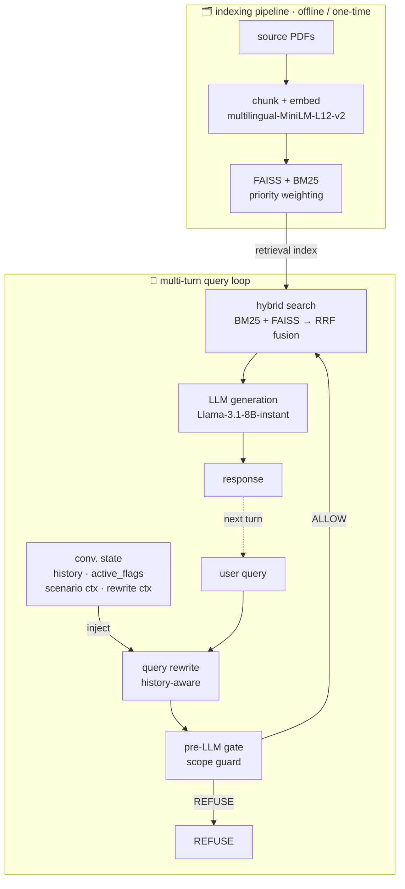

# AML Red Flag RAG System

> **An end-to-end Hybrid RAG system for AML red flag identification, integrating regulatory source prioritization and metadata-aware retrieval weighting.**
>

[](https://python.org)
[](https://ai.google.dev/)
[](https://faiss.ai/)
[](https://www.fatf-gafi.org/)

---

## 🌟 Overview / 專案概述

This project builds a Hybrid RAG system designed as an educational tool for identifying money laundering red flags from transaction scenarios. 

The system ingests bilingual AML documents — FATF international standards (English) and Taiwan regulatory training materials (Chinese) — constructs a dual-index (dense + sparse), and generates structured assessments with cited evidence and confidence levels (confirmed / possible / unlikely / refuse).

Core question the system answers:

> Given a transaction scenario described in Chinese, what red flags are present, how certain are we, and which regulatory source supports the assessment?
> 

本專案以洗錢防制（AML）紅旗辨識為應用場景，建構一套從文件處理到結構化輸出的完整 RAG pipeline。核心挑戰在於：知識庫同時包含英文國際標準（FATF）與中文本地素材，而使用者查詢以中文為主——系統必須跨語言檢索、依文件層級排序，並產出有文件依據的中文評估。系統定位為教育輔助工具，協助理解紅旗指標的定義與適用情境，並支援具備上下文記憶的多輪追問 (Multi-Turn Conversation)。

---

## 🛠 Technical Highlights / 技術亮點

- **Hybrid Search (BM25 + FAISS → RRF Fusion)**：雙路召回搭配 Reciprocal Rank Fusion，兼顧精確術語匹配與語意相似度檢索。
- **Metadata-driven Priority Weighting**：三層文件優先級 core / sector_specific / knowledge_bridge
- **Cross-lingual Retrieval**：以 multilingual embedding 對齊中英文語意空間，讓中文查詢能有效檢索英文法規文件。
- **Pre-LLM Gate (Deterministic Guardrail)**：以 rule-based 邏輯在 LLM 生成前攔截超出知識範圍的查詢，將 binary 的範圍判斷從機率性行為中分離。解決了弱模型（Llama-8B）不聽從「拒絕回答」指令的幻覺問題。
- **Stateful Multi-Turn Conversation (Query Rewrite & State Decoupling)**：不依賴單純的對話紀錄拼接，而是將使用者追問結合歷史狀態（Conversation State）利用 LLM 動態改寫為獨立查詢（Standalone Query），解決 RAG 在多輪對話中常見的「代名詞指代遺失（Catastrophic Forgetting）」與「向量偏移」問題。
- **Retrieval Stress Test (De-keyworded Queries)**：設計三級語意距離的壓力測試，驗證檢索管線在使用者不使用標準術語時的穩定性與失敗模式。

---

## 🗂️ Repository Structure

```
aml-redflags-rag/
│
├── README.md
├── requirements.txt
├── .gitignore
│
├── indexing/                        # Indexing Pipeline (Write once)
│   └── build_data_v2.py             #   PDF → Chunk → FAISS + BM25
│
├── experiments/                     # Retrieval + Generation Experiments
│   ├── experiment_rag_v1.ipynb      #   v1: Dense + BM25 + RRF → LLM
│   └── experiment_rag_v2.py         #   v2: + metadata layers, priority weighting, pre-LLM gate
│
├── eval/                            # Evaluation Design
│   ├── test_cases.py                #   8 end-to-end scenario test cases (RF-01 ~ RF-08)
│   └── queries/
│       ├── basic_50.json            #   Basic retrieval: exact terms, concepts, data
│       ├── scenario_20.json         #   Scenario-based: multi-hop reasoning
│       ├── list_15.json             #   List-type: enumerate all red flags of X
│       └── cross_chunk_10.json      #   Cross-chunk: info spans multiple chunks
│
├── artifacts/                       # Reproducibility artifacts
│   └── chunks.json                  #   Pre-built chunk store (v2 config)
│
└── docs/
    ├── pipeline_design.md           # Architecture decisions & rationale
    ├── experiment_log.md            # Experiment changelog (v1 → v2)
    └── naming_convention.md         # Coding standards & terminology
```

---

## 🏗️ System Architecture



### Document Metadata Layers (v2 design)

| Layer | Documents | `retrieval_priority` | Role |
| --- | --- | --- | --- |
| `core` | FATF TBML Red Flags | 1.0 | Authoritative international standard |
| `sector_specific` | FATF Virtual Assets Red Flags | 0.9 | Domain extension |
| `knowledge_bridge` | TW AML Training Slides | 0.8 | Local regulation + explainability |

---

### 📊 Retrieval Benchmarking (The Science)

為了驗證系統在真實場景中的檢索能力，本專案設計了 **`scenario_20` 壓力測試集**。

此測試刻意在某幾題採用「去關鍵字（De-keyworded）」策略，將查詢分為三級語義距離（從「保留法規術語」到「完全口語化與抽象化」），藉此探測模型語意泛化的邊界。

### 1. 測試設計與數據表現 (Top-K=5)

測試涵蓋三個語義抽象層級：Level 1（保留術語） → Level 2（行為描述） → Level 3（極端抽象比喻）。

| **檢索策略** | **P@3** | **P@5** | **Recall@5** | **MRR** |
| --- | --- | --- | --- | --- |
| **Dense (FAISS)** | 0.267 | 0.180 | **0.825** | **0.670** |
| **BM25** | 0.083 | 0.050 | 0.250 | 0.250 |
| **Hybrid (RRF)** | 0.250 | 0.180 | **0.825** | 0.649 |

> *註：因多數題目僅 1 個 Gold Chunk，P@5 理論上限為 0.2。數據顯示 **Dense 主導了檢索效能**，而 Hybrid (RRF) 反而導致 MRR 微幅下降。*
> 

### 2. 核心工程洞察 (Engineering Insights)

**🔍 洞察一：BM25 的跨語言數學約束 (Cross-lingual Lexical Trap)**

- **現象**：BM25 在 14 題跨語言查詢（中文問 → 英文答）中召回率為 0，且 Top-5 全數錯誤指向語料庫中唯一的中文文件（訓練投影片）。
- **根因**：這並非模型能力不足，而是 **Lexical Matching 的數學限制**。當中英文 token 交集為空時，BM25 只能在中文子空間內給分，形成「高頻通用詞吸引效應」。

**🔍 洞察二：RRF 融合在系統性偏差下的污染效應 (Hybrid Noise)**

- **現象**：在傳統認知中，Hybrid Search 總能提升表現；但在本專案，Hybrid 的 MRR (0.649) 低於純 Dense (0.670)。
- **根因**：RRF 的前提是「錯誤互補」。但在此場景下，BM25 產生的是**指向同一份文件的系統性偏差**。這使得 BM25 不僅沒提供增益，反而將錯誤結果注入 RRF，稀釋了 Dense 原本正確的排名（例：案例 S01 的正解被從第 3 名擠到第 4 名）。

**🔍 洞察三：Embedding 語意泛化的極限 (Semantic vs. Register Shift)**

- **成功邊界**：Dense 能精準處理 Level 3 的極端抽象（例：將「付款流程被篡改」抽象為「一段約定在節點被替換」，MRR=1.0），展現強大的結構對應能力。
- **失敗邊界**：在案例 S15 中，當查詢從「分析性語域（法律術語）」跳躍至「敘事性語域（日常說故事：'說不清楚哪裡來的財物...'）」，即使沒有跨語言問題，Dense 依然全面失效（MRR=0.0）。這揭示了**「語域轉換 (Register Shift)」比單純的「去關鍵字」更具破壞性**。

**🔍 洞察四：多輪對話的狀態解耦 (State Decoupling in Multi-Turn)**
- **現象**：在測試多輪追問（Query Rewrite）時，若直接將前一輪的系統輸出（含大量 JSON 結構與評估理由）餵給 8B 模型作為歷史紀錄，會導致模型重構意圖失敗，甚至產生格式雜訊（如輸出帶有 `改寫：` 前綴）。
- **根因**：輕量級 LLM 在處理高密度結構化資料與自然語言混雜的 Prompt 時，容易發生注意力渙散。
- **工程解法**：在對話狀態管理中實作「讀寫分離」。系統後台維護嚴格的 `conversation_state` (JSON)，但餵給 Rewrite 模組的歷史紀錄則轉換為純粹的 `content_readable` (自然語言摘要)。此舉大幅提升了輕量模型在多輪意圖重構的穩定性。

### 3. 檢索失敗分析與優化方向 (Failure Analysis)

將測試中的失敗模式歸納為三類，並對應出開發者的解決思維：

| **失敗模式** | **典型案例** | **核心痛點** | **工程優化路徑 (Roadmap)** |
| --- | --- | --- | --- |
| **語言邊界鎖死** | S01-S14 (BM25) | 中文問項與英文法規無 Token 重疊 | **語言路由機制**：自動判定 Query 語言與目標文件語言，動態調整 BM25 權重。 |
| **語域轉換失效** | S15 (Dense) | 「說故事」的語氣模型讀不懂 | **Query Expansion**：請 LLM 先將使用者的日常口語轉化為「法規關鍵字」後再檢索。 |
| **文件內精度不足** | S08 (Dense) | 找對了文件，但正解落在隔壁段落 | **切片策略優化**：調整 Chunk 大小或增加重疊度 (Overlap)，避免語意被切斷。 |

### 🛠️ 4. 為什麼仍然保留 BM25？ (Design Rationale)

雖然在目前的數據中 BM25 的分數偏低，但這是基於**「當前語料庫 70% 為英文」**的結構性結果。

- **戰略儲備**：本系統的願景是處理完整的 AML 知識庫。當未來引入大量**「中文法規本文」**（作為 Core 層級）時，BM25 對於「實質受益人」、「層次化」等專有名詞的精準抓取，將會是不可或缺的核心戰力。
- **拒絕過度優化**：我們選擇在架構中保留 `use_bm25` 開關，而非直接移除，是為了保留系統對環境變動（Distribution Shift）的彈性。這確保了當語料分佈改變時，系統只需調整參數即可適配，不需重寫邏輯。

---

### 🎯 System Verification (End-to-End Logic)

Each test case is a realistic transaction scenario with:

- `expected_assessment`: `confirmed` / `possible` / `refuse`
- `expected_flags`: list of red flag codes (e.g. `["RF-01", "RF-02"]`)
- `required_sources`: which documents the answer must cite

| Test | Red Flag | Confirmed | Possible |
| --- | --- | --- | --- |
| RF-01 | Structuring (門檻拆分) | ✓ 1A | ✓ 1B |
| RF-02 | Rapid Movement (快速流轉) | ✓ 2A | ✓ 2B |
| RF-03 | Abnormal Cash (現金密集) | ✓ 3A | ✓ 3B |
| RF-04 | Third-Party Operation (第三人代辦) | ✓ 4A | ✓ 4B |
| RF-05 | Cross-Border High Risk (跨境高風險) | ✓ 5A | ✓ 5B |
| RF-06 | Profile Mismatch (與身分不符) | ✓ 6A | ✓ 6B |
| RF-07 | Virtual Asset Anonymity (虛擬資產匿名) | ✓ 7A | ✓ 7B |
| RF-08 | Opaque Ownership / Out-of-Scope | ✓ 8A | refuse 8B |

在生成階段，本專案的重點並非依賴龐大參數模型的湧現能力，而是建立**可靠的工程防禦機制（Guardrails）**，確保系統的輸出下限。

**1. Deterministic Pre-LLM Gate（確定性安全門控）**

- **問題**：開發初期發現，當遇到超出知識庫範圍的問題（例如：貿易型洗錢 TBML）時，小型模型（如 Llama-3.1-8B）經常忽略 System Prompt 中的 `REFUSE` 指令，試圖基於預訓練知識進行幻覺生成。
- **實作**：在 LLM 推論前介入一層純 Python 的 Rule-based 攔截器。透過 `KnowledgeManifest` 定義知識邊界，一旦偵測到 `not_covered_topics` 且缺乏相關證據，系統會直接中斷並回傳標準化的拒答 JSON，**完全繞過 LLM**。
- **成果**：在超出範圍的負面測試案例（如 RF-08B）中，達到 100% 的準確拒絕率。

**2. 使用「弱模型」作為壓測探針 (Model Selection as a Probe)**

- 系統支援無縫切換多種模型（Llama-3.3-70B, Gemini 2.0 Flash 等）。但在開發核心邏輯時，我們**刻意選擇能力較弱的 Llama-3.1-8B 作為主力測試模型**。
- **設計意圖**：大型模型強大的預訓練知識會「掩蓋」檢索系統的漏失；使用 8B 模型能迫使我們直面真實的 Retrieval 品質，確保系統的準確性是建立在「檢索到的法規依據」上，而非模型的隨機發揮。

**3. 雙重結構化約束 (Dual Structural Constraints)**

- 結合 Prompt 層級的 JSON Schema 定義與 API 層級的強制輸出模式（如 Groq `response_format={"type": "json_object"}`），確保系統輸出的評估結果（Confirmed / Possible / Unlikely / Refuse）能 100% 被下游應用程式解析。

---

## 🛠️ Tech Stack / 技術棧

| Component | Technology |
| --- | --- |
| PDF Parsing | `pypdf` |
| Chunking | `langchain-text-splitters` `RecursiveCharacterTextSplitter` |
| Embedding | `sentence-transformers/paraphrase-multilingual-MiniLM-L12-v2` |
| Dense Index | `FAISS` (`IndexFlatIP`, normalized cosine) |
| Sparse Index | `rank_bm25` (`BM25Okapi`), `jieba` for Chinese tokenization |
| LLM | Google Gemini 2.0 Flash / Llama-3.3-70B (Groq) |
| Runtime | Google Colab |

## 📁 Source Documents / 文件來源

| Document | Category | Language |
| --- | --- | --- |
| [FATF: Trade-Based Money Laundering Risk Indicators](https://www.fatf-gafi.org/en/publications/Methodsandtrends/Trade-based-money-laundering-risk-indicators.html) | `core` | EN |
| [FATF: Virtual Assets Red Flag Indicators](https://www.fatf-gafi.org/en/publications/Fatfrecommendations/Virtual-assets-red-flag-indicators.html) | `sector_specific` | EN |
| Taiwan AML Training Slides (洗錢防制訓練教材) | `knowledge_bridge` | ZH |

> PDFs are not included in this repository due to file size. Place them in `data/` before running the indexing pipeline.
>
> 
---
## 🧪 System Evolution / 系統演進

本專案採敏捷迭代開發，逐步解決 RAG 系統在實際應用中的痛點：

- **v1.0 Stateless Baseline**：建立基礎的 Hybrid Search (FAISS + BM25) 與 RRF 融合機制。發現單純的相似度檢索無法區分「法規權威性」。
- **v2.0 Metadata & Guardrails**：
  - 引入 **Priority Weighting**：為 Chunk 標籤化 (`core`, `sector_specific`) 並給予權重，確保國際標準(FATF)的排序優於一般教材。
  - 引入 **Pre-LLM Gate**：以 Rule-based 邏輯在檢索前攔截超出範圍的問題，成功消除了 Llama-3-8B 等輕量模型「無法拒答」的幻覺。
- **v3.0 Stateful Multi-Turn**：
  - 引入 **Query Rewrite** 解決多輪追問的向量空間偏移。
  - 實作 **State Decoupling**：在對話紀錄中分離「JSON 結構化狀態」與「自然語言摘要」，避免 LLM 在讀取歷史時因 JSON 格式產生注意力渙散 (Attention Dilution)。
---

## 🚀 Quick Start

```bash
# 1. Clone & install dependencies
git clone https://github.com/YOUR_USERNAME/aml-redflags-rag.git
cd aml-redflags-rag
pip install -r requirements.txt

# 2. Place source PDFs in data/
# data/fatf_tbm_laundering_red_flags.pdf
# data/fatf_virtual_assets_red_flags.pdf
# data/tw_aml_training_slides.pdf

# 3. Run indexing pipeline
python indexing/build_data_v2.py

# 4. Run experiment (Google Colab recommended)
# Open experiments/experiment_rag_v2.py in Colab
```

---

## 🔮 Roadmap & Limitations / 未來展望與限制

基於實驗結果，後續開發將著重於以下三個層面：

1. **檢索路由化 (Intelligent Routing)**：開發 Query-type 分類器，自動判斷該採用 Hybrid 還是純 Dense 檢索，減少雜訊干擾。
2. **查詢重寫 (Query Rewriting)**：利用 LLM 處理使用者的日常敘事，在檢索前自動補齊遺失的法律術語。
3. **評估自動化**：將 `scenario_20` 整合進 CI/CD 流程，確保每次調整 Prompt 或 Chunking 時，檢索品質不會退化（Regression Testing）。
