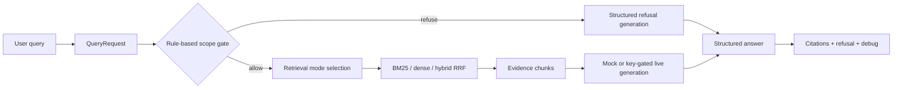

# Demo Walkthrough v1

## 1. One-Minute Project Summary

This is an AML red-flag RAG demo that migrated notebook experiments into a
runnable, single-turn FastAPI service. The project focuses on evidence-bound
answers: each response can expose an assessment, identified red flags,
citations, refusal behavior, retrieved chunk IDs, and retrieval fallback
details. Deterministic mock mode is the default, so the service and evaluation
flows can run without API keys. It is an educational engineering demo, not
legal advice or a production transaction-monitoring system.

## 2. What Problem This Repo Demonstrates

RAG demos can be difficult to review when the important logic lives only in
notebooks, depends on private artifacts, or presents plausible answers without
showing how they were supported. AML-style analysis makes those weaknesses
especially visible because reviewers need evidence, citation traceability,
scope boundaries, and a way to debug inconsistent behavior.

This repository demonstrates how to package a research notebook into a
reviewable service. It separates the stable single-turn path into modules,
ships a small runnable corpus, exposes structured API behavior, and keeps
evaluation claims tied to the artifacts that support them.

## 3. System Flow: One Query



The gate runs before retrieval. An obvious out-of-scope request is refused and
short-circuits retrieval. An allowed query uses the requested retrieval mode;
if dense or hybrid retrieval is unavailable, the effective fallback is visible
in `debug`. Mock mode is deterministic by design, and citations are produced
from retrieved evidence chunks rather than unrelated sources.

## 4. What To Demo Live

Create the environment only if it is not already available:

```powershell
python -m venv .venv
.venv\Scripts\python.exe -m pip install -r requirements-lite.txt
.venv\Scripts\python.exe -m uvicorn api.main:app --reload
```

In another PowerShell window:

```powershell
Invoke-RestMethod http://localhost:8000/health

$body = @{
  query = "Funds show rapid movement through a virtual asset exchange and the transaction pattern is inconsistent with the customer's stated student profile."
  retrieval_mode = "hybrid"
  llm_mode = "mock"
  include_debug = $true
} | ConvertTo-Json

Invoke-RestMethod -Uri http://localhost:8000/query `
  -Method Post -ContentType "application/json" -Body $body

.venv\Scripts\python.exe scripts\run_api_smoke_eval.py
.venv\Scripts\python.exe scripts\run_cqc_eval.py --report-md eval\reports\cqc_latest.md
.venv\Scripts\python.exe scripts\run_failure_diagnostics.py
.venv\Scripts\python.exe scripts\run_reviewer_pack.py
```

In the query response, point out:

- `assessment`: the structured judgment.
- `identified_flags`: which red-flag concepts were identified and why.
- `citations`: the evidence excerpts attached to the response.
- `debug.retrieved_chunk_ids`: the chunks used as retrieval context.
- `debug.fallback_used`: whether the requested retrieval or generation mode
  degraded to an available fallback.
- `refusal`: whether the scope gate refused the request and why.

## 5. How Evaluation Is Organized

### A. Unit and Contract Tests

`pytest` validates schemas, the FastAPI contract, evaluator helpers, and
reviewer-pack helpers. These tests are deterministic and do not require a
running API service.

### B. API Smoke Eval

The API smoke evaluator checks a running service at the HTTP boundary. It
validates response fields and expected behaviors; it does not calculate P@K,
Recall@K, or MRR.

### C. Historical Retrieval Benchmark

The historical benchmark is based on a private 226-chunk corpus. Its evidence
files remain documented and traceable, but the benchmark is not re-run against
the committed 12-chunk sample corpus.

### D. CQC-RAG Lite

CQC-RAG Lite is a cross-query consistency regression harness. It checks whether
semantically equivalent query variants produce sufficiently stable
assessments, flags, citations, and retrieved evidence. It is not a full
CQC-RAG implementation, logits-based answer selection, or a model-quality
benchmark.

### E. Reviewer Demo Pack

The reviewer pack is a local convenience runner that records static validation
and optional live evaluations in a Markdown report. It helps review the
repository but does not replace the underlying tests or evaluators.

### F. Failure Diagnostics Lite

Failure Diagnostics Lite reads existing API smoke and CQC-RAG Lite outputs and
classifies observable failure signals for review. It is diagnostic tooling,
not a benchmark or a change to the RAG pipeline.

## 6. What Changed From Notebook To Service

The migration extracted configuration, schemas, artifact loading, retrieval,
scope gating, generation, and pipeline orchestration into focused modules. It
removed Colab-only runtime assumptions, added FastAPI endpoints, introduced
deterministic mock mode, shipped small sample artifacts, and added contract
tests and reviewer-facing documentation. Private data and generated binary
artifacts remain outside Git.

## 7. Design Choices Worth Explaining

### Mock Mode Is Not a Placeholder

Mock mode is deterministic, API-key-free, and evidence-bound. That makes it
useful for contract tests, regression checks, CI-style validation, and reviewer
demos where provider availability should not change the result.

### Honest Fallback Matters

Dense retrieval may be unavailable in the lite profile. In that case, the
service degrades to BM25 and records the effective mode, fallback flag, and
reason in `debug`. It does not pretend that dense or hybrid retrieval ran.

### Refusal Is Part of the Product Surface

AML analysis needs explicit scope boundaries. The rule-based gate refuses
obvious out-of-scope topics before retrieval, while grey-area cases are allowed
through rather than being over-blocked.

### Evaluation Artifacts Are Separated By Claim Type

Checks against the committed demo corpus are kept separate from historical
private-corpus benchmark claims. CQC-RAG Lite is presented as a regression
harness, not as a reproduction of the full research method.

## 8. Known Limitations

- The committed knowledge corpus contains only 12 hand-written sample chunks.
- This is not a production AML system and does not provide legal advice.
- There is no user authentication or database.
- The service API is single-turn; multi-turn routing remains outside it.
- Live LLM providers are key-gated and experimental.
- Docker configuration is provided but has not been verified on the documented
  Windows development host.
- The historical 226-chunk corpus is private and is not fully committed.

## 9. Next Roadmap

1. CQC report closure: completed.
2. Failure Diagnostics Lite: completed.
3. Gemma refactor.
4. Intent routing.
5. Multi-turn conversation.

The next valuable engineering layer is Failure Diagnostics: classify and
report failure modes such as retrieval fallback, evidence instability,
citation drift, flag instability, low source overlap, and out-of-scope or
refusal behavior. This turns evaluation failures into actionable debugging
signals before expanding the model or conversation surface.

## 10. Five-Minute Spoken Script

This project started as an AML RAG notebook. I converted the stable single-turn
path into a FastAPI service so the behavior can be tested, reviewed, and run
without Colab. The core design principle is evidence traceability: every answer
can expose what it retrieved, what it cited, whether it refused, and whether
any retrieval fallback happened.

The migration work was mainly about turning implicit notebook state into
explicit engineering boundaries. Configuration, request and response schemas,
artifact loading, retrieval, scope gating, generation, and orchestration now
have separate responsibilities. The committed repository uses a small
hand-written corpus so a reviewer can run it, while the private corpus and
binary retrieval artifacts stay outside Git. That keeps the runnable demo
honest about what is included and what remains historical research evidence.

When a query reaches the API, it becomes a typed `QueryRequest`. A rule-based
scope gate runs first. If the request is clearly outside the demo's AML red-flag
scope, the service returns a structured refusal and skips retrieval. If the
query is allowed, the pipeline selects BM25, dense, or hybrid RRF retrieval.
The lite installation can run without the dense embedding model, so when a
dense or hybrid request falls back to BM25, that fallback is reported honestly
in the debug response.

The retrieved chunks become the evidence context for generation. Mock mode is
the default and requires no API key. It is deterministic and evidence-bound,
which makes it useful for reviewers and regression tests rather than merely a
temporary substitute for a live model. Key-gated live providers are available
as experimental paths, but the repository does not depend on them for its
baseline behavior.

The API response is structured around an assessment, identified red flags,
citations, refusal information, and optional debug traces. In a live demo, I
point to the citation excerpts and `debug.retrieved_chunk_ids` to show how the
answer connects to evidence. I also point to `fallback_used` because silent
degradation is a common source of misleading RAG demos.

For the live walkthrough, I start with `/health`, then submit one AML scenario
that combines rapid virtual-asset movement with a customer-profile mismatch.
That gives me a concrete response where I can explain assessment, flags,
citations, retrieved chunks, and fallback behavior. I then run the API smoke
evaluation to show boundary-level checks, the CQC-RAG Lite evaluator to show
paraphrase consistency, and the reviewer pack to produce one readable local
summary. Each layer answers a different review question rather than collapsing
everything into one ambiguous quality score.

Evaluation is separated by claim type. Unit and contract tests validate the
code and API surface. The API smoke evaluator checks a running service. The
historical retrieval benchmark documents results from a private 226-chunk
corpus, but those results are not presented as reproducible on the committed
12-chunk demo corpus. CQC-RAG Lite checks cross-query consistency across fixed
paraphrases; it is a regression harness, not a full CQC-RAG implementation or
a model-quality benchmark. The reviewer pack combines the key local checks into
a readable report without replacing the underlying tests.

The project is deliberately scoped. It is not legal advice, a production AML
platform, or a multi-turn service. The next engineering step is Failure
Diagnostics: turning retrieval fallback, citation drift, flag instability, and
low evidence overlap into clear failure categories. After that, the roadmap
moves through a Gemma refactor, intent routing, and then multi-turn
conversation.
